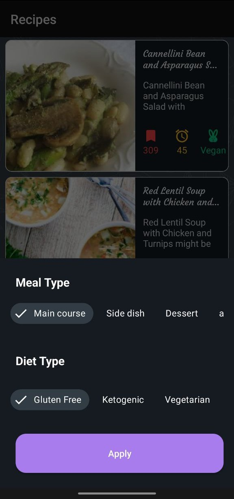
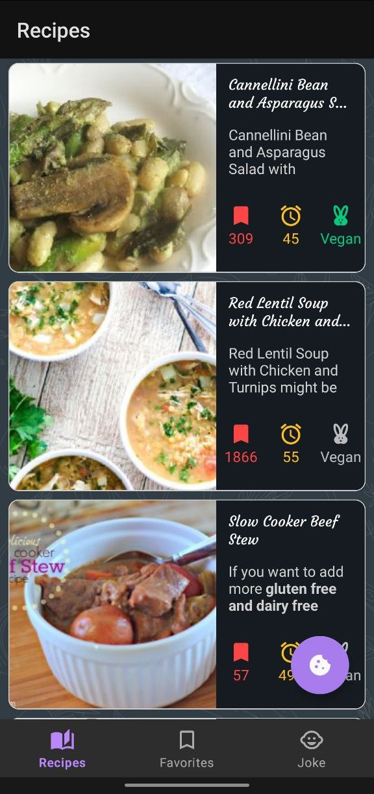
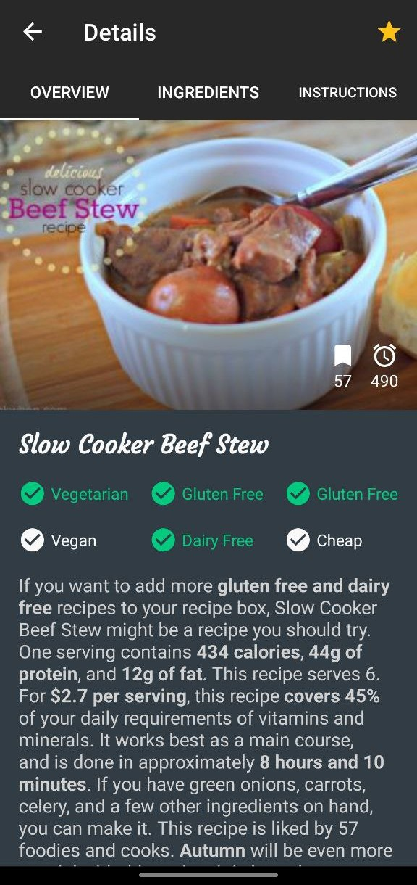

# FoodyLearn

Hello, my name is Ivanov Alexandr, and this is my code style examle and private codebase repository. 

## Stack:
* Mvvm/MVI
* Hilt
* Retrofit
* LiveData
* Coroutines
* Picasso
* Room
* Jetpack navigation

  
  &nbsp;
  
  &nbsp;
  

